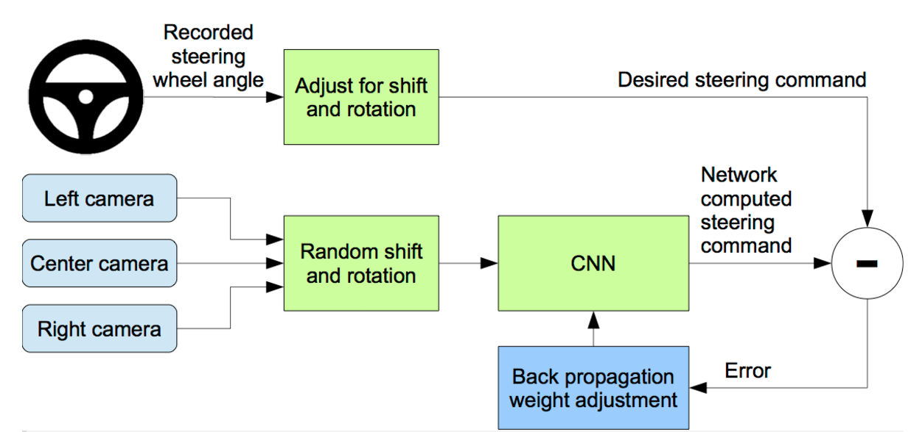

# Behavioral Cloning Project

Behavioral cloning is a method by which human behavioral skills can be captured and reproduced in a computer program.
### Steps Involved in the Behavioral Cloning
***
1. As the human performs the skill, his or her actions are recorded along with the situation that gave rise to the action. 
2. Log of these records is used as an input to a learning program. 
3. The learning program outputs a set of rules that reproduce the skilled behavior.
4. Then These skills will be applied on the target platform to replicate or Outperform the human skills.
***
This method can be used to construct automatic control systems for complex tasks for which classical control theory is inadequate. It can also be used for training.

### Motivation and Background
Behavioral cloning (Michie, Bain, & Hayes-Michie, 1990) is a form of learning by imitationwhose main motivation is to build a model of the behavior of a human when performing a complex skill. Preferably, the model should be in a readable form.

### Below is the architecture used by  Nvidia paper which replicates the current project scenario

|[]

## Project Description

In this project, I use a neural network to clone car driving behavior.  It is a supervised regression problem between the car steering angles and the road images in front of a car.  

Those images were taken from three different camera angles (from the center, the left and the right of the car).  

The network is based on [The NVIDIA model](https://devblogs.nvidia.com/parallelforall/deep-learning-self-driving-cars/) as cited above.
 

### Files included

- `model.py` The script used to create and train the model.
- `drive.py` The script to drive the car. You can feel free to resubmit the original `drive.py` or make modifications and submit your modified version.
- `utils.py` The script to provide useful functionalities (i.e. image preprocessing and augumentation)
- `model2.h5` The model weights.
- `Behavioral_Cloning_Project` to augment the reader about the model in jupyter notebook format of mode code and to view some statistics of the model parameters.

Note: drive.py is originally from [the Udacity Behavioral Cloning project GitHub](https://github.com/udacity/CarND-Behavioral-Cloning-P3)

#### To Understand the Dependencies of the project and required tools please visit the README.md at this project level

## Model Architecture Design

The design of the network is based on [the NVIDIA model](https://devblogs.nvidia.com/parallelforall/deep-learning-self-driving-cars/), which has been used by NVIDIA for the end-to-end self driving test.   

It is a deep convolution network which works well with supervised image classification / regression problems. 
I've added the following adjustments to the model. 

- I used Lambda layer to normalized input images to avoid saturation and make gradients work better.
- I have used the Cropping layer to crop the required portion of the image.
- I have added an additional dropout layer to avoid overfitting after the convolution layers.
- I have also included RELU for activation function for every layer except for the output layer to introduce non-linearity.

In the end, the model looks like as follows:

- Image normalization
- Cropping the images
- Convolution layers with 5x5 kernels
* filter: 24, strides: 2x2, activation: RELU
* filter: 36, strides: 2x2, activation: RELU
* filter: 48, strides: 2x2, activation: RELU
- Convolution layers with 3x3 kernels
* filter: 64, strides: 1x1, activation: RELU
* filter: 64, strides: 1x1, activation: RELU
- Drop out (0.5)
- Fully connected Layers
* neurons: 256, activation: ELU
* neurons:  128, activation: ELU
* neurons:  64, activation: ELU
* neurons:   1 (output)

As per the NVIDIA model, the convolution layers are meant to handle feature engineering and the fully connected layer for predicting the steering angle.  However, as stated in the NVIDIA document, it is not clear where to draw such a clear distinction.  Overall, the model is very functional to clone the given steering behavior.  

The below is a model structure output from the Keras which gives more details on the shapes and the number of parameters.

Layer (type)                 Output Shape              Param #   
=================================================================
lambda_1 (Lambda)            (None, 160, 320, 3)       0         
_________________________________________________________________
cropping2d_1 (Cropping2D)    (None, 65, 320, 3)        0         
_________________________________________________________________
conv2d_1 (Conv2D)            (None, 31, 158, 24)       1824      
_________________________________________________________________
conv2d_2 (Conv2D)            (None, 14, 77, 36)        21636     
_________________________________________________________________
conv2d_3 (Conv2D)            (None, 5, 37, 48)         43248     
_________________________________________________________________
conv2d_4 (Conv2D)            (None, 3, 35, 64)         27712     
_________________________________________________________________
conv2d_5 (Conv2D)            (None, 1, 33, 64)         36928     
_________________________________________________________________
dropout_1 (Dropout)          (None, 1, 33, 64)         0         
_________________________________________________________________
flatten_1 (Flatten)          (None, 2112)              0         
_________________________________________________________________
dense_1 (Dense)              (None, 256)               540928    
_________________________________________________________________
dense_2 (Dense)              (None, 128)               32896     
_________________________________________________________________
dense_3 (Dense)              (None, 64)                8256      
_________________________________________________________________
dense_4 (Dense)              (None, 1)                 65        
=================================================================
Total params: 713,493
Trainable params: 713,493
Non-trainable params: 0

## Data Preprocessing

### Image Sizing

- I have cropped the images using the Cropping2D function  of the Keras which has helped to focus the training only on road than other un necessary data.

### Image Augumentation

For training, I used the following augumentation technique:

- Have choose all of the right, left or center images.
- For left image, steering angle is adjusted by +0.2
- For right image, steering angle is adjusted by -0.2
- Done flip image left/right.
- Done translate image horizontally with steering angle adjustment (0.002 per pixel shift)

### Examples of Augmented Images

The following are the example images used:

**Center Image**

**Left Image**

**Right Image**

## Training, Validation and Test

I splitted the images into train and validation set in order to measure the performance at every epoch.  Testing was done using the simulator.

As for training, 

- Have used mean squared error for the loss function to measure how close the model predicts to the given steering angle for each image.
- Have used Adam optimizer for optimization.
- Have used ModelCheckpoint from Keras to save the model only if the validation loss is improved which is checked for every epoch.

## Outcome

The model can drive the course without bumping into the side ways.
attached the video file as run2.mp4 in the path.

- [The Lake Track - Link](run2.mp4)

## References
- NVIDIA model: https://devblogs.nvidia.com/parallelforall/deep-learning-self-driving-cars/
- Udacity Self-Driving Car Simulator: https://github.com/udacity/self-driving-car-sim
